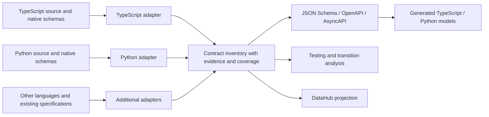

# Polyglot contract inventory and transition analysis

Build `for-contracts` as a shared inventory workflow inside `analyzing-codebase`. Both `for-testing` and `for-transitioning` consume it. Start with TypeScript and Python across monorepo, Kiban, and Kanban. Inventorying monorepo is a primary use case: use its contracts and dependencies to manage the transition away from it. The useful first result is a traceable view of what crosses a boundary, what each side expects, and what remains uncertain before moving that boundary.

This plan defines the staged target. The static helper and contract/testing/transition workflows are implemented. The next implementation adds bounded TypeScript workspace aliases, local native artifact import, and schema-to-TypeScript/Python generation with a synthetic conformance corpus. Native export execution, deeper transition artifacts, external API expansion, and DataHub publication remain proposed. See the [first-slice validation record](../validation/contract-inventory-first-slice.md) and [native import and generation record](../validation/contract-inventory-native-generation.md) for tested scope and limits. This plan supersedes the TypeScript-first sequence in the [tooling investigation](../designs/2026-09-14-contract-inventory-tooling.md), which contains the earlier executable probes and tool qualifications.

## Architecture and language strategy

Use a small TypeScript coordinator for the inventory and exporters, with language adapters that can run in their native runtime. A versioned JSON request/result protocol lets the Python adapter use Python's AST and Pydantic directly. Another language can add an adapter without changing the inventory format. Keep compiler and framework versions explicit and isolate tool dependencies from the analyzed repository.

The first implementation uses the TypeScript 5.9.3 compiler API directly for selected-source resolution and Python's standard-library AST. Both adapters project a bounded static schema subset and retain gaps. Native ts-rest/Zod and Pydantic/FastAPI export paths remain follow-on work requiring isolated execution. Additional ast-grep/Tree-sitter rules can broaden structural discovery; framework adapters still establish registration and wire behavior. The tooling investigation records the compatibility limits found so far.



Ax provides a useful precedent: TypeScript is its behavioral reference; extractors produce conformance fixtures, and an intermediate representation drives native language output. Source inspection found the schema fixture extractor calling the TypeScript validators and the Go compiler's verification path invoking generated Python conformance tests. Borrow that separation and its conformance gate. Ax's compiler itself is not a proposed dependency. [Compiler design](https://github.com/ax-llm/ax/blob/3951b0531514b62ec533ad0de218716847f0a931/docs/COMPILER.md), [fixture extractor](https://github.com/ax-llm/ax/blob/3951b0531514b62ec533ad0de218716847f0a931/tools/axir/extractors/schema-validation-goldens.ts), [verification implementation](https://github.com/ax-llm/ax/blob/3951b0531514b62ec533ad0de218716847f0a931/tools/axir/internal/axir/verify.go).

Conversion is useful in both directions. Python models can produce JSON Schema and then TypeScript declarations; TypeScript schemas can produce JSON Schema and then Python models. Generated files carry their source contract ID, generator version, and conversion limitations. The original declaration remains authoritative until a separate transition explicitly changes ownership. Porting reusable adapter logic between languages is also reasonable when shared fixtures preserve its observable behavior.

Use JSON Schema as the initial portable schema format, with an explicit dialect per artifact. Preserve native constraints and behavior that it cannot express. Start generated HTTP artifacts with a tested OpenAPI 3.1 profile; preserve imported 3.0 or 3.2 documents in their original version. Any conversion between dialects needs its own loss report. AsyncAPI and CUE can be added as projections as their adapters become useful.

## Inventory contract

The shared intermediate representation is an evidence envelope around declarations, schemas, operations, and relationships. Avoid building a universal programming-language type system before the first useful analysis.

| Record | Required information |
| --- | --- |
| Declaration | Repository, language, source symbol and location, kind, native type/schema reference, visibility, extraction status |
| Schema | Native artifact and dialect, portable projections, input/output/wire role, validation and serialization behavior, conversion gaps |
| Operation | Owning service or provider, protocol, version, method/path or channel, request and response variants, evidence of registration or use |
| Relationship | Caller/callee, produces/consumes, validates, serializes, references, or shared-state dependency; evidence for the specific edge |
| Evidence | Source revision and content hash, source span, tool/version/configuration, basis such as declaration, client expectation, runtime validation, observation, or reviewed hypothesis |
| Coverage | Scan roots and exclusions, languages and adapter capabilities, files examined/skipped/failed, candidates resolved/partial/unsupported, unresolved references and reasons |

Keep operation identity independent of the consuming repository. Inbound/outbound is relative to each application: the same operation can be Kiban's inbound boundary and Kanban's outbound dependency. Keep method, path, API version, response status, and media type distinct. Schema similarity is a candidate relationship, not evidence of shared ownership or compatibility.

Use stable IDs with source revision as provenance. Renames need explicit alias/move records rather than heuristic deletion and recreation. Store agent-reviewed annotations separately from generated records, tied to the evidence hash they reviewed. A rescan can mark an annotation stale without erasing it. Record dirty working-tree content as well as the base commit.

Discover all candidate declarations within the stated scan boundary, including internal types. Deeply resolve boundary-reachable types first. Functions, opaque handles, dynamic types, unsupported syntax, and unresolved generic constructions still receive inventory records even when JSON Schema cannot represent them. Coverage counts describe the scanned population; they do not imply discovery of every possible runtime contract.

## First source examples

These are static source findings from 2026-09-14. Application processes and live integrations were not run.

| Example | Evidence | Consequence for the first adapter |
| --- | --- | --- |
| Monorepo tool dispatch and shared types | `services/calls/process-tools/src/index.ts` imports shared `@domu/types` declarations and provider registries, validates a Zod request, and looks up `VAPI_TOOLS_BY_NAME`; `src/toolsMap.ts` in the same service binds tool names to implementations | Follow package aliases, runtime validation, registry dispatch, and provider-specific variants; a function declaration alone does not describe the exposed tool contract |
| Kiban TypeScript contracts | `src/api/v1/internal/calls/tools/tools.contract.ts` imports ts-rest and Zod; `scripts/generate-openapi-specs.ts` calls `generateOpenApi` | Reuse native export and reconcile declarations with route mounting |
| Kanban Python API | `src/app/run_api.py` includes `calls_router`; `src/app/api/routers/calls.py` registers `POST /calls/start`, status 202, returning `StartCallResponse` | Recover router prefixes, status, annotations, and response omission settings |
| Kanban conditional validation | `StartCallRequest.validate_transport_fields` in `src/app/services/calls/models/api_models.py` changes requirements according to `webrtc_test` | Attach validator evidence; schema export alone cannot establish the conditional runtime contract |
| Kanban outbound tools | `DynamicToolManager.create_generic_tool` uses `HTTPSessionManager` and `session.request`, with a configurable URL or a fallback path | Follow the wrapper and serialization; retain an unresolved configured destination alongside the known fallback |
| Kanban event delivery | `src/app/services/events/event_service.py` uses `model_dump(exclude_none=True, by_alias=True)`, a configured destination, and retry handling | Capture the wire shape separately from the Python model and retain delivery behavior |

Monorepo revision: `16aab70bd2076ece35f192814fe8a234569ca394`. Kiban revision: `039829b6b61718248b5b665ef86369e25486e677`. Kanban revision: `7d08ee0bbd6bf28d03280d8ded78fa8af737f427`. Paths are relative to their respective local checkouts under `/Users/mike/code/domu-ai/`.

Kanban's API module calls `create_app()` at import time; that function sets up observability, and its imported router constructs a service. Begin with static discovery. Execute native exports only through an inspected isolated entrypoint with network access blocked and synthetic configuration. An unsafe or unavailable export becomes a reported gap rather than an application startup dependency.

## Delivery sequence

### 1. One inventory from two languages

Deliver a narrow end-to-end `for-contracts` workflow: synthetic legacy TypeScript registry/handler, TypeScript/ts-rest/Zod, and Python/FastAPI/Pydantic examples produce one inventory, portable schemas, an HTTP specification, and a readable coverage report. Include schema declarations, mounted routes, low-level outbound calls, and provider-specific tool dispatch. Scope the first adapters to those explicit patterns and report other patterns as unsupported.

Survey monorepo's services and shared packages to establish the legacy baseline: candidate types/schemas, entrypoints, inbound and outbound APIs, registrations, and state/message dependencies. Record unsupported boundary kinds and unexamined areas in coverage. Resolve `services/calls/process-tools/` and its shared-type dependencies deeply for the first pilot, alongside the Kiban and Kanban examples. Expand the baseline service by service; the bounded pilot is not a claim that monorepo has been fully inventoried.

Owned changes in this repository:

- Extend `skills/analyzing-codebase/SKILL.md` with `for-contracts` routing and add `references/for-contracts.md` plus `references/contract-inventory.md`.
- Extend `references/workspace.md` with the inventory artifacts and multi-repository provenance. Keep existing testing artifacts compatible.
- Add a proposed `skills/analyzing-codebase/scripts/contract-inventory/` package for the coordinator, versioned JSON protocol/schema, TypeScript adapter, Python adapter, and pinned dependency manifests. Keep installation explicit and local; importing an adapter must not install dependencies or execute the target app.
- Add synthetic fixtures and adapter integration tests beside that package. Extend the existing skill tests and `scripts/validate.js` to exercise the public scan/export command. The package's test command and installation instructions are part of this slice.

Write outputs under the analyzed workspace's `docs/code-analysis/contracts/`: `inventory.json`, `coverage.json`, `summary.md`, and directories for native schemas and portable exports. A multi-repository scan records each root, revision, exclusions, and coverage independently, then links contracts across repositories. Put JSON provenance inside the JSON envelope; retain the existing YAML frontmatter convention for Markdown analysis files.

Acceptance: both language adapters use the same protocol and produce deterministic content for unchanged inputs. Tests independently enumerate expected declarations and boundaries, including an internal type, an unmounted declaration, an unresolved destination, and an unsupported refinement. The export distinguishes GET and POST on one path and retains non-200 successes and error responses. A missing adapter or failed parse leaves a partial scan with diagnostics. Run the first local source pilot on the bounded monorepo, Kiban, and Kanban paths above, reporting unresolved cases without broadening permissions or starting services. Preserve provider variants and shared-package references; report coverage separately for each repository.

### 2. Make the inventory useful for a transition

Depends on slice 1. Add `references/for-transitioning.md`; update `references/for-testing.md` and mode routing to consume the same inventory. Reuse artifacts when their revision, dependencies, and extraction configuration are current; refresh affected records otherwise.

Produce `transition-analysis.md` for one capability moving out of monorepo, using Kiban and Kanban as candidate destinations where source evidence supports them. Trace the actual call sites before asserting that old and new implementations correspond. Include current and proposed ownership, callers and implementations, shared state and transaction coupling, protocol/behavior mismatches, characterization tests, coexistence and cutover, rollback limits, and evidence required to remove the old path. A TypeScript-to-Python or Python-to-TypeScript move is a supported transition scenario.

Maintain `transition-inventory.json` and a readable `transition-inventory.md` over the legacy baseline. For each capability, record its monorepo contracts and variants, intended disposition (move, replace, retire, retain temporarily, or undecided), replacement contracts and destination, remaining callers, shared-state dependencies, behavioral gaps, migration stage, and retirement evidence. Allow split/merged capabilities and replacements outside Kiban or Kanban. Keep proposed mappings distinct from verified correspondences. Record the next blocker and required action so the inventory can drive migration sequencing.

Retirement requires more than an endpoint disappearing from source. Check caller movement across all scanned repositories, external consumers and registrations, outstanding jobs or messages, shared state, and rollback dependencies. Record deployment/runtime evidence still required when unavailable. A partial scan or no static references cannot mark a capability safe to delete. Rescans report new legacy dependencies, changed contracts, and unresolved retirement blockers; progress is measured against an explicit baseline and scan scope.

Acceptance: every proposed extraction boundary links to inventory evidence; unresolved mappings remain explicit. The testing analysis derives a useful check for conditional validation, serialization, and retry behavior. A deliberately compatible-looking schema pair with different runtime validation must still block an unsupported equivalence claim. A synthetic caller remaining in monorepo blocks retirement of its dependency; removing it during an incomplete scan does not establish retirement. Review the generated transition artifact against the source call chain and demonstrate how it identifies the next step toward removing one legacy capability.

### 3. Expand external API coverage

Depends on slice 1 and feedback from slice 2. Extend adapter rules for fetch/Axios and aiohttp/HTTPX/requests as actual repositories require them. Prioritize wrappers, configurable base URLs, path and query construction, authentication mechanisms, request encoding, and response transformations. Add SDK mapping only when package/version and provider-operation evidence exists.

Preserve the provider's published specification at a recorded revision/hash and generate a separate client-used OpenAPI surface. Client casts, type annotations, or generics remain expectations. Record runtime validators separately. A candidate with insufficient method/path/response evidence remains in coverage when it cannot be emitted as a valid partial operation.

Acceptance: two applications calling one provider operation link to one identity; an unresolved dynamic destination stays visible; conflicting provider and client schemas remain separate and produce a discrepancy. Synthetic tests exercise encoded queries, body serialization, response unwrapping, and an unvalidated response cast. Add an offline mock-provider check, evaluating Prism for that role.

### 4. Prove useful conversion in both directions

Depends on slice 1. Evaluate [json-schema-to-typescript](https://github.com/bcherny/json-schema-to-typescript) for TypeScript declarations and [datamodel-code-generator](https://datamodel-code-generator.koxudaxi.dev/supported_formats/) for Python models. Use [Pydantic's validation and serialization schema modes](https://docs.pydantic.dev/latest/concepts/json_schema/) where native Python export is available. These conversion candidates were documentation-reviewed; this plan does not claim their compatibility has been tested.

Keep a supported subset and a conformance corpus for required versus nullable fields, aliases, omitted values, unions, recursion, enums, numeric limits, dates, defaults, extra fields, and custom validators. Test source validation/serialization, the portable schema, and generated target behavior separately. Generated TypeScript declarations require a separate runtime validator if runtime checks are desired.

Acceptance: one Python-origin schema generates usable TypeScript declarations and one TypeScript-origin schema generates usable Python models. Compile/import generated code, exercise shared valid/invalid payloads, and compare serialized output. For unsupported semantics, preserve the original rule, emit a conversion gap, and prohibit an automatic equivalence claim. No generated file silently becomes the source of truth. Select exact generator versions only after this probe passes.

### 5. Publish a browsable DataHub projection

Depends on slice 1. Build and test a metadata-file exporter before connecting to DataHub. Use standard schema and API endpoint entities, stable contract IDs, source links, and properties for extraction status. Expose repository ownership and, after slice 2, transition status and links to replacement contracts and retirement blockers. Preserve separate method/path operations and complete native specifications in the portable artifacts. The earlier DataHub 1.7.0 probe found that its stock OpenAPI ingestion collapsed or omitted required cases; reuse the SDK, with our own mapping.

Acceptance offline: replaying the same inventory produces the same owned metadata; GET/POST sharing a path, POST 201, and DELETE 204 remain separately identifiable. Request, response status, and media type distinctions remain accessible. Partial scans cannot delete records, human annotations survive, and type references never become data lineage without data-flow evidence. Distinguish analyzed revisions from deployed versions.

Then validate browsing and repeat publication against the authorized DataHub environment. Check schema fields, endpoint identities, provenance links, and consumer navigation in the UI before claiming those views work. DataHub availability must not gate local analysis or conversion. Live Domu access follows the account requirements in the workspace guidance.

### 6. Broaden contracts and add observed evidence

Depends on the relevant earlier adapters. Add database schemas, query projections, queue producers/consumers, callbacks, and tool registrations from concrete repository examples. Add AsyncAPI exports for resolved messaging boundaries and retain delivery/order/idempotency behavior in the inventory. Register additional languages through the same adapter protocol, with their supported constructs and omissions declared.

Recorded HTTP exchanges are an optional evidence adapter. The existing synthetic Redocly probe supports evaluating capture-to-spec and drift checks, but its generated OpenAPI 3.2 output needs explicit downstream compatibility checks. Capture-derived paths, required fields, and enums remain hypotheses until better evidence supports them. Use synthetic recordings for development and report exercised scenarios.

Acceptance: each new adapter ships a known-positive discovery fixture, a deliberate unsupported case, portable-export checks, and an example that changes a testing or transition decision. Add schema/API diff tools by the dialects actually in use. CUE becomes useful when a concrete constraint-composition task justifies it.

## Verification and rollout

Slice 1 introduces the adapter integration command and pins its environments. After dependencies are installed, the repository's existing aggregate gate is:

```bash
node scripts/validate.js
```

That entrypoint already runs hook/skill tests, curation, prose integration, evaluation, Zellij, and related bundled checks. Extend it to run the new offline contract tests; do not describe the current gate as covering adapters that do not exist yet. Each later slice adds its relevant regression fixtures at the same boundary.

The first release can be used through the skill with bounded agent review. Automated extraction reports its capabilities and gaps; the agent resolves important cases from source and adds evidence-backed annotations. Broader rollout follows the monorepo/Kiban/Kanban pilot and demonstrated usefulness of the transition artifact. Expand monorepo coverage by capability and use remaining dependencies to sequence its retirement. Publish generated artifacts atomically and retain the previous successful inventory when a scan fails.

## Pressure-test results and remaining decisions

The shared inventory and native adapters survive the main counterexamples. A single conversion layer can erase refinements; retaining originals and testing conversion losses addresses that. Syntax-only discovery cannot establish mounted routes or imported type meaning; semantic and registration adapters address those separately. Unresolved runtime configuration prevents a complete static URL inventory, so coverage is a first-class output.

Python and monorepo enter the first slice, and transition analysis arrives before broad extractor coverage. Legacy registry dispatch is therefore part of the initial adapter scope. That gives us a concrete modernization result before investing in every language or protocol. Generated language models and DataHub are independent consumers of the inventory and can follow in the order their users need them.

Exact adapter/generator versions, a safe native-export entrypoint for each target, and DataHub's practical relationship navigation remain acceptance questions. Resolve them through the bounded probes above. Automatic application-code transpilation, a universal semantic compiler, and custom DataHub entities have no demonstrated need in the first release.
